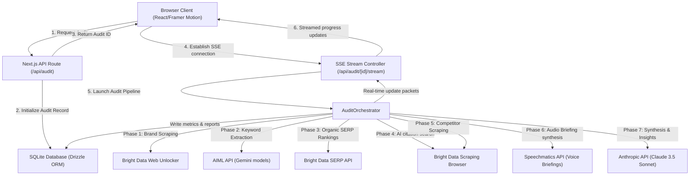

# 🛰️ AEOspy

> **The first Answer Engine Optimization radar — powered by Bright Data web intelligence.**

Traditional SEO tells you where you rank on Google. **AEOspy** tells you if you exist in the minds of AI agents. Brands that rank #1 on organic search are increasingly finding themselves invisible in answers generated by ChatGPT, Gemini, Perplexity, and Copilot. This is the **Answer Engine Optimization (AEO) Gap**.

AEOspy bridges this gap by orchestrating a swarm of autonomous agents that query AI engines, cross-reference organic SERP data, and scrape competitor pages to provide actionable recommendations for improving your AI visibility.

---

## 🎯 How It Works

1. **Enter Your Domain**: Simply enter your brand name and domain (or try our pre-cached demo mode with `hubspot.com` or `salesforce.com`).
2. **Multi-Agent Audit**: AEOspy deploys parallel agents via **Bright Data's** infrastructure to:
   - Extract keywords and entity signals from your homepage.
   - Query 6 major AI engines to check for citations and hallucinations.
   - Pull organic SERP rankings to identify visibility gaps.
   - Scrape competitor pages to reverse-engineer their AEO success.
3. **Actionable Report**: Receive a comprehensive dashboard with a 3D geo-radar, hallucination flags, and a prioritized list of technical action items (e.g., adding specific Schema markup).

---

## ✨ Key Features

- **6-Engine Radar**: Tracks citations across ChatGPT, Gemini, Perplexity, Grok, Copilot, and Google AI Overview.
- **Bright Data Integration**: Utilizes Web Unlocker, SERP API, and Scraping Browser for unblockable web data access.
- **Hallucination Monitor**: Detects and flags factually incorrect claims AI engines make about your brand.
- **Visibility Gap Detection**: Highlights keywords where you rank highly on Google but are ignored by AI engines.
- **Voice Briefings**: Stream an executive audio summary of your audit using Speechmatics TTS.
- **Real-Time Streaming**: Watch the multi-agent orchestrator work in real-time via Server-Sent Events (SSE).

---

## 🕷️ Bright Data Integration

This project was built for the **Bright Data AI Agents & Web Data Hackathon** on lablab.ai, heavily leveraging Bright Data's platform:

- **Web Unlocker**: Used to scrape target brand homepages and extract schema markup, headings, and value propositions without getting blocked.
- **SERP API**: Bypasses Google's bot protection to pull accurate, localized organic search rankings for identified keywords.
- **Scraping Browser / LLM Scraper**: Queries AI engines directly to determine if the target brand is cited in generated answers.
- **Batch Scraping**: Extracts data from top-ranking competitor pages to perform differential analysis.
- *(Prepared for)* **MCP Server**: The codebase includes architectural readiness for the Bright Data MCP server to enable tool-use loops directly within the orchestrator.

---

## 🛠️ Tech Stack

- **Framework**: Next.js 15 (App Router)
- **Language**: TypeScript
- **Styling**: Tailwind CSS v4, Framer Motion (Glassmorphism & 3D Canvas)
- **Database**: SQLite with Drizzle ORM
- **Web Intelligence**: Bright Data APIs
- **AI / LLMs**: Gemini (via AIML API), Claude 3.5 Sonnet (Anthropic SDK)
- **Voice**: Speechmatics API

---

## 🚀 Getting Started

### Prerequisites
- Node.js 18+
- API Keys for Bright Data, Anthropic, and AIML API (for Gemini)

### Setup

1. **Clone the repository:**
   \`\`\`bash
   git clone https://github.com/Shikhyy/AEOspy.git
   cd AEOspy
   \`\`\`

2. **Install dependencies:**
   \`\`\`bash
   npm install
   \`\`\`

3. **Configure Environment Variables:**
   Copy the example environment file and fill in your keys:
   \`\`\`bash
   cp .env.example .env.local
   \`\`\`
   *(See the `Environment Variables` section below)*

4. **Initialize Database:**
   Push the Drizzle schema to the local SQLite database:
   \`\`\`bash
   npx drizzle-kit push
   \`\`\`

5. **Run the Development Server:**
   \`\`\`bash
   npm run dev
   \`\`\`
   Visit `http://localhost:3000` to view the app.

---

## 🔑 Environment Variables

| Variable | Description |
|---|---|
| \`BRIGHT_DATA_API_TOKEN\` | Master token for Bright Data APIs |
| \`BRIGHT_DATA_SERP_ZONE\` | Zone name for SERP requests (default: `serp_zone`) |
| \`BRIGHT_DATA_UNLOCKER_ZONE\`| Zone name for Web Unlocker (default: `web_unlocker`) |
| \`BRIGHT_DATA_BROWSER_ZONE\` | Zone name for Scraping Browser (default: `scraping_browser`) |
| \`AIML_API_KEY\` | For accessing Gemini models via aimlapi.com |
| \`ANTHROPIC_API_KEY\` | For Claude 3.5 Sonnet synthesis & streaming |
| \`SPEECHMATICS_API_KEY\` | (Optional) For Text-to-Speech voice briefings |
| \`DATABASE_URL\` | (Optional) SQLite path (default: `file:./sqlite.db`) |

---

## 🧪 Demo Mode

If you don't have API keys set up, AEOspy includes a high-fidelity **Demo Mode**. 
Simply search for **HubSpot** (`hubspot.com`), **Salesforce** (`salesforce.com`), or **Notion** (`notion.so`) to view pre-cached audit results with realistic data and animated insights.

---

## 🏗️ Architecture

### System Architecture

### Audit Sequence Flow

```mermaid
sequenceDiagram
    autonumber
    actor User as Browser (Client)
    participant Server as Next.js API Route
    participant DB as SQLite (Drizzle ORM)
    participant Orch as AuditOrchestrator
    participant BD as Bright Data APIs
    participant AI as Gemini & Claude 3.5

    User->>Server: POST /api/audit (Domain URL)
    Server->>DB: Insert empty Audit Record (status: pending)
    Server-->>User: Return { auditId, streamUrl }
    
    User->>Server: GET /api/audit/[id]/stream (Establish SSE Connection)
    Server->>Orch: Initialize & execute audit(id)
    
    rect rgb(20, 20, 20)
        Note over Orch, BD: Phase 1: Brand Scraping
        Orch->>BD: Scraping home page (Web Unlocker)
        BD-->>Orch: Return Markdown contents
    end
    
    rect rgb(20, 20, 20)
        Note over Orch, AI: Phase 2: Keyword Enrichment
        Orch->>AI: Extract brand entities & target keywords (Gemini)
        AI-->>Orch: Return keyword array
    end

    rect rgb(20, 20, 20)
        Note over Orch, BD: Phase 3: Organic Rank Analysis
        Orch->>BD: Query Google Search for keywords (SERP API)
        BD-->>Orch: Return organic ranking lists
    end

    rect rgb(20, 20, 20)
        Note over Orch, BD: Phase 4 & 5: AI Engine Citation & Competitor Diff
        Orch->>BD: Query ChatGPT/Perplexity/Gemini (Scraping Browser)
        BD-->>Orch: Return engine response text & sources
    end

    rect rgb(20, 20, 20)
        Note over Orch, AI: Phase 6: Synthesis & Insights
        Orch->>AI: Generate AEO recommendations & final score (Claude 3.5)
        AI-->>Orch: Stream Markdown insight blocks
    end
    
    Orch->>DB: Update Audit Record (status: completed, visibilityScores, reports)
    Orch-->>User: SSE event "done" with completed payload
```

---

*Submitted for the lablab.ai Bright Data AI Agents & Web Data Hackathon (May 2026).*
